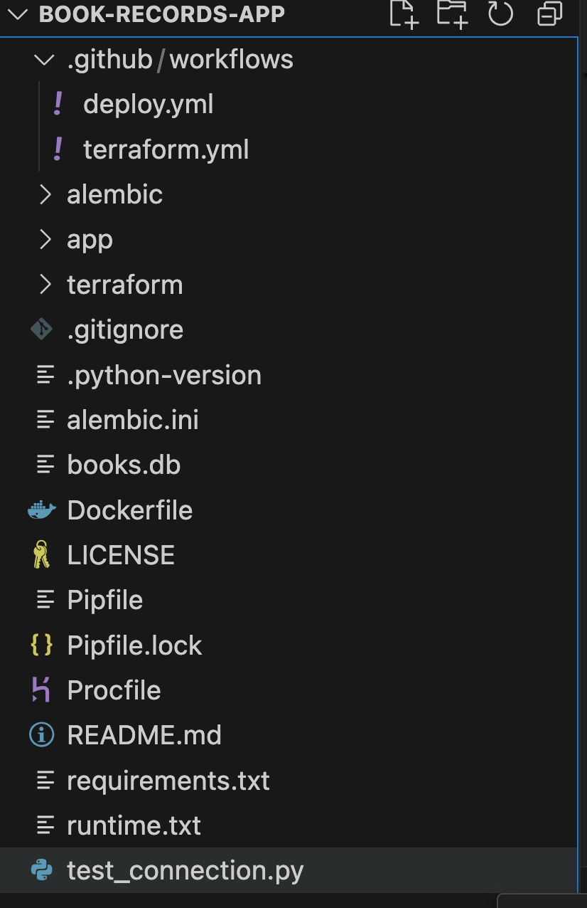

# FastAPI Book Records App

A robust RESTful API service built with FastAPI for managing book records, featuring real-time updates via Server-Sent Events (SSE).


## This read me provides:
- Clear project overview
- Setup instructions
- Detailed endpoint documentation
- Infrastructure explanation
- Security considerations
- Future improvements


## Features
- CRUD operations for book management
- JWT-based authentication
- Real-time updates using SSE
- Infrastructure as Code using Terraform
- Automated deployment via GitHub Actions

## Technology Stack
- **Framework**: FastAPI
- **Database**: SQLite
- **Authentication**: JWT
- **Dependency Management**: Pipenv
- **Infrastructure**: Terraform
- **CI/CD**: GitHub Actions
- **Real-time Updates**: Server-Sent Events (SSE)

## Project Structure





## Environment Setup

### Prerequisites
- Python 3.10.13+
- Pipenv
- Terraform (optional, for infrastructure management)

### Why Pipenv?
This project uses Pipenv instead of traditional pip requirements for several key benefits:
- Deterministic builds through dependency locking
- Automatic virtual environment management
- Separation of development and production dependencies
- Hash-verification for enhanced security
- Maintains compatibility across different Python versions
- Simplified dependency management with a single `Pipfile`

### Installation
```bash
# Clone the repository
git clone https://github.com/chaitu568/book-records-app

# Install dependencies using Pipenv
pipenv install

# Activate virtual environment
pipenv shell

# Run the application
uvicorn app.main:app --reload
```


## Docker Setup(second way of running application)

### Prerequisites
- Docker installed on your machine

### Docker Configuration
The application includes a Dockerfile for containerization, making it easy to run in any environment.

### Build the Image

`docker build -t book-records-app .`

### Run the Container

`docker run -p 8000:8000 -e PORT=8000 book-records-app`


## API Endpoints
### Authentication
* POST /login
   * Authenticate user and receive JWT token
   * Required for accessing protected endpoints
Book Management
* GET /books/
   * Retrieve all books with pagination
   * Query parameters: skip, limit
* GET /books/{book_id}
   * Retrieve a specific book by ID
* POST /books/
   * Create a new book
* PUT /books/{book_id}
   * Update an existing book
* DELETE /books/{book_id}
   * Delete a book by ID
Real-time Updates
* GET /stream/html
   * HTML interface for viewing real-time book updates
* GET /stream/data
   * SSE endpoint for real-time book operation events


## Infrastructure as Code (IaC)
- Terraform Implementation
- The project uses Terraform for infrastructure management, providing:

- Consistent environment creation
- Version-controlled infrastructure
- Easy scaling and modifications
- Reproducible deployments
- Cost-effective resource management

### State Management

- State files are committed to Git for simplicity
- Remote state hosting can be implemented for production environments
- State changes are tracked through version control

### Security

- Environment variables managed through GitHub Secrets
- Sensitive data never committed to repository
- Terraform variables used for configuration

## Testing
## Authentication Setup

### Creating a New User
Before using the API endpoints, you need to create a user and obtain a JWT token.

1. Create a user using the `/users/` endpoint:
```http
POST /users/

{
    "username": "testuser",
    "password": "yourpassword123"
}

Response:

{
    "id": 1,
    "username": "testuser",
    "is_active": true
}
```

- In Swagger UI (/docs):

- Click the "Authorize" button at the top
- enter you user name and password, you will hae you session for 30 mins
- you can try out all the endpoints.

- Test users with IDs 2 and 9 have been removed as they were used for testing purposes.
- Known Limitations

- SQLite database used for simplicity (can be migrated to PostgreSQL for production)
- Local state management in Terraform (can be upgraded to remote state)

## Future Improvements

- Implement remote state management for Terraform
- Add database migrations
- Enhance test coverage
- Add monitoring and logging

### License
MIT License